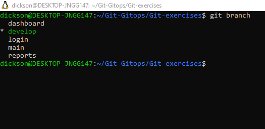

# Git-exercises
This repository contains Git exercises
# 1. Multi-Branch Feature Integration Challenge
Scenario
A team is building a cloud cost optimization dashboard.
You must:
Create:
feature/login
feature/dashboard
feature/reports
Each branch should contain:
Different files
At least 3 commits
Merge all branches into develop
Finally merge develop into main
Requirements
Use meaningful commit messages
Resolve at least one merge conflict
Use pull request style workflow
Skills Tested
Branching
Merge workflow
Conflict resolution
Commit history
Collaboration practices

# 2. Two Students Edit Same Line (Conflict Lab)
Scenario
Two students edit the same configuration line in:
config/app.env
Student A changes:
APP_MODE=development
Student B changes:
APP_MODE=production
Tasks
Simulate conflict using two branches
Merge branches
Resolve conflict manually
Keep both environments in separate config files
Commit final resolution
Skills Tested
Merge conflicts
Manual conflict resolution
Best practices

# 3. Recover From Disaster (Reset vs Revert)
Scenario
A bad deployment was pushed to production.
Tasks
Create 5 commits
Introduce a broken configuration in latest commit
Undo using:
git revert
Repeat exercise using:
git reset --soft
git reset --hard
Explain differences
Skills Tested
Undoing mistakes
History management
Safe rollback strategies

***Git revert is used to undo changes of a specific commit by creating a brand new commit that contains the exact opposite changes***

***git reset --soft (commit hash) is used to undo the commits by moving the commits back to the commit hash pointed but keeps all your file changes staged in the index and untouched in your working directory ***

***git reset --hard (commit hash) is immediately and permanently deletes all uncommitted changes in your working directory and staging area to match the target state***
# 4. Simulated Team Collaboration Workflow
Scenario
You are working as:
Backend engineer
DevOps engineer
Reviewer
Tasks
Fork a repository
Clone fork locally
Create feature branch
Push changes
Open pull request
Perform code review comments
Merge after approval
Bonus
Add GitHub branch protection rules.
Skills Tested
GitHub collaboration
PR workflow
Code reviews
Team collaboration
#  5. Git Rebase vs Merge History Lab
Scenario
A repository has a messy commit history.
Tasks
Create:
feature/api
Make 7 small commits
Rebase interactively:
squash commits
reword commits
Compare:
merge workflow
rebase workflow
Requirements
Explain:
When rebasing is safe
Why rebasing shared history is dangerous
Skills Tested
Rebasing
Clean history
Interactive rebase

# 6. Emergency Hotfix Production Scenario
Scenario
Production application is down.
Tasks
Create:
main
develop
release/v1.2
Introduce production bug
Create:
hotfix/login-failure
Fix issue
Cherry-pick fix into:
develop
release/v1.2
Skills Tested
Hotfix workflow
Cherry-picking
Release management
Branching strategies

# 7. Stash and Context Switching Exercise
Scenario
You are halfway through feature development when an urgent bug arrives.
Tasks
Start unfinished work
Modify multiple files
Stash changes
Switch branch
Fix urgent bug
Return to previous work
Apply stash
Resolve stash conflicts if any
Skills Tested
Stashing
Branch switching
Workflow efficiency

# 8. Accidental Secret Exposure Recovery
Scenario
A developer accidentally commits:
API keys
passwords
.env file
Tasks
Commit sensitive data
Push to remote
Remove secrets from history
Add .gitignore
Rotate secrets
Force push cleaned history
Requirements
Explain:
Why force push is risky
Git security best practices
Skills Tested
Git security
History rewriting
Secret management

